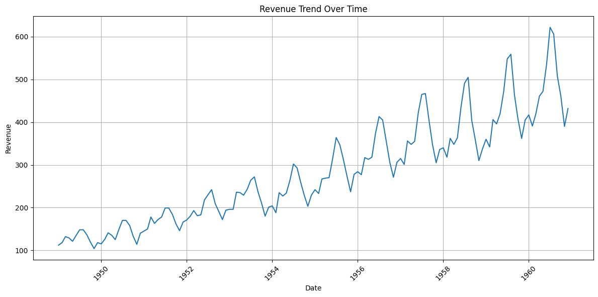
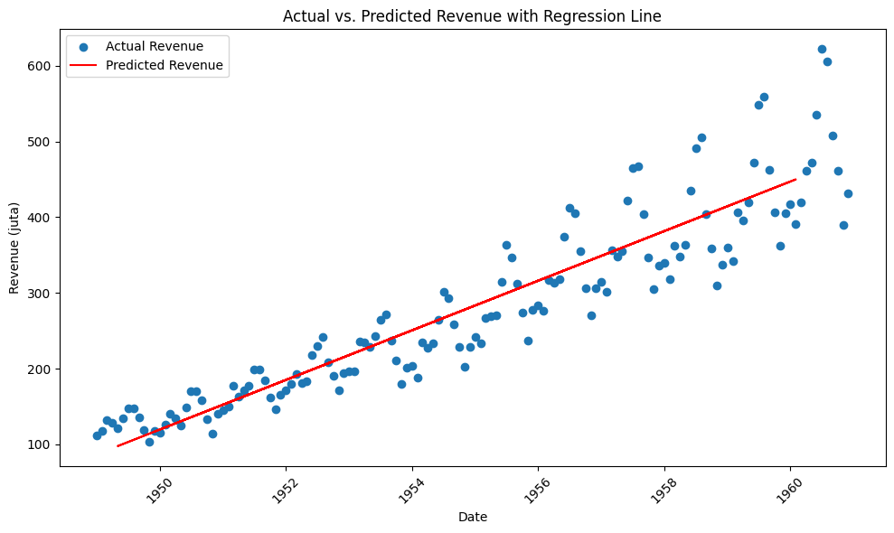
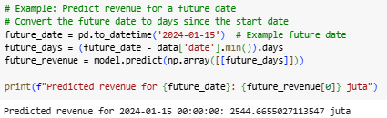

# 📈 Revenue Prediction Using Linear Regression

## 🔧 Project Structure

- `data/revenue_data.csv`: The revenue dataset
- `notebook/revenue_prediction.py`: Main exploratory and modeling notebook.

## 🌟 EDA


Berdasarkan grafik tren, dilihat dari garis lurus berwarna merah sebagai tren linear, nilai revenue cenderung meningkat dari waktu ke waktu, dengan fluktuasi musiman kecil.

## 🌟 Modeling
Model Machine Learning dibuat untuk memprediksi nilai revenue terhadap waktu, dihitung dari waktu mulai perhitungan. Algoritma Machine Learning yang digunakan adalah Linear Regression. Pertama-tama, data dipisah menjadi 80% untuk training test dan 20% untuk data test.



Hasil model prediksi ditunjukkan dalam grafik Revenue aktual yang dibandingkan dengan garis prediksi Revenue. Titik biru menunjukkan nilai revenue yang sebenarnya sesuai dalam dataset, sedangkan garis merah menunjukkan hasil prediksi model Linear Regression berdasarkan tanggal. Pada tahun-tahun awal, nilai revenue yang sebenarnya tidak jauh dengan nilai revenue yang diprediksi model Linear Regression. Namun, seiring bertambahnya waktu, nilai revenue aktual mulai jauh dari nilai revenue yang diprediksi model. Dari model ini, dihasilkan formula berikut,

```
Revenue = 86.9213 + 0.0897 × days_since_start
```

yang berarti, setiap harinya, revenue diprediksikan dapat bertambah sekitar 89.7 ribu.

## 📈 Evaluation Metrics
| Metric                                | Value           |
|---------------------------------------|-----------------|
| Mean Absolute Percentage Error (MAPE) | 12.17%          |
| Root Mean Squared Error (RMSE)        | 39.63           |
| R² Score                              | 0.84            |
Hasil metrik ini menunjukkan bahwa model Linear Regression telah bekerja dengan cukup baik dengan kesalahan prediksi atau margin error masih minim di angka 12%. 

## 🧠 Predict Future Revenue 
Model ini dapat digunakan untuk memprediksi revenue di masa depan dengan convert tanggal yang ingin diketahui. 



Contohnya, prediksi revenue untuk tanggal 15 Januari 2-24 adalah sekitar 2.544 juta
